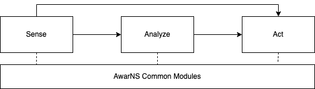

# @AwarNS Framework

The AwarNS Framework (reads like Awareness *[əˈwernəs]* Framework), is a [NativeScript](https://nativescript.org/)-based application development framework created to simplify the development of mobile applications that need to react to the changes in the context of the phone, even when the app is not visible. 

Unlike other similar frameworks, this has been developed with background execution in mind. No matter if the app is not open when the change occurs, if there is a listener for the change, a reaction to the change will be triggered in the form of a developer-defined task. This means the framework is completely background-first.

This is possible thanks to the well-tested [NativeScript Task Dispatcher](https://github.com/GeoTecINIT/nativescript-task-dispatcher) (NTD), which is at the [core](packages/core/README.md) of the AwarNS framework. Indeed, this framework takes the task definition and execution model offered by the NTD and extends it with primitives to ease the development of context-aware plugins and applications. Due to that the NTD only supports the Android platform for now, this framework shares this same limitation (**iOS is not supported**).

AwarNS sits as a modular layer on top of the NTD. This means that it is possible to build applications with just the minimum number of dependencies required by each application use case. Each individual module is available as a separate NPM package. The modules can be classified in 4 categories, depending on their purpose: common, sense, analyze and act. The following figure depicts how the 4 categories are related:

## Framework modules

The following tables list the modules that come with the framework, grouped by the 4 categories: common, sense, analyze and act. However, the possibilities of the framework are not limited to the modules listed here. It is perfectly fine to develop internal (domain-specific) plugins to extend what is offered by the framework in any of these categories (see our [Detailed usage and extension](TUTORIALS.md#detailed-usage-and-extension) guide). Similarly, contributions of new (general-purpose) plugins are welcome (see our [Contributing](CONTRIBUTING.md) guide).

### Common

| Module                                        | Summary                                                                                                                                                                                                                                                                                           | Latest release                                                                                                 | Downloads                                                                                              |
|-----------------------------------------------|---------------------------------------------------------------------------------------------------------------------------------------------------------------------------------------------------------------------------------------------------------------------------------------------------|----------------------------------------------------------------------------------------------------------------|--------------------------------------------------------------------------------------------------------|
| [@awarns/core](packages/core/README.md)       | **Always install this plugin.** This will enable your app to configure and use the rest of the plugins. It is required to develop your own features on top of the framework. [[docs](packages/core/README.md)]                                                                                    |        |        |
| [@awarns/tracing](packages/tracing/README.md) | **(Optional plugin)** We suggest you to install and configure this plugin if your background execution workflow is not trivial (more than a handful of tasks). It facilitates some degree of debugging and profiling while the app is running in production. [[docs](packages/tracing/README.md)] |  |  |

### Sense

| Module                                                      | Summary                                                                                                                                                                                                                                    | Latest release                                                                                                               | Downloads                                                                                                            |
|-------------------------------------------------------------|--------------------------------------------------------------------------------------------------------------------------------------------------------------------------------------------------------------------------------------------|------------------------------------------------------------------------------------------------------------------------------|----------------------------------------------------------------------------------------------------------------------|
| [@awarns/battery](packages/battery/README.md)               | Install this plugin if you want to obtain the remaining battery level of the device on a regular basis. [[docs](packages/battery/README.md)]                                                                                               |                |                |
| [@awarns/geolocation](packages/geolocation/README.md)       | Install this plugin if you want to access the location of the phone, even in background, on a regular basis. [[docs](packages/geolocation/README.md)]                                                                                      |        |        |
| [@awarns/wifi](packages/wifi/README.md)                     | Install this plugin if you want to scan for nearby Wi-Fi access points (APs) on a regular basis, even in background. [[docs](packages/wifi/README.md)]                                                                                     |                      |                      |
| [@awarns/ble](packages/ble/README.md)                       | Install this plugin if you want to perform regular scans for nearby Bluetooth Low Energy devices, even if the app is not actively running (in background). [[docs](packages/ble/README.md)]                                                |                        |                        |
| [@awarns/human-activity](packages/human-activity/README.md) | Install and configure this plugin if your app can benefit from listening to updates in the activity being performed by the user (or object) carrying the phone (including background updates). [[docs](packages/human-activity/README.md)] |  |  |

### Analyze

| Module                                                      | Summary                                                                                                                                                                   | Latest release                                                                                                       | Downloads                                                                                                    |
|-------------------------------------------------------------|---------------------------------------------------------------------------------------------------------------------------------------------------------------------------|----------------------------------------------------------------------------------------------------------------------|--------------------------------------------------------------------------------------------------------------|
| [@awarns/geofencing](packages/geofencing/README.md)         | Install and configure this plugin if your app requires to be notified of changes in the position relative to an area of interest. [[docs](packages/geofencing/README.md)] |  |  |

### Act

| Module                                                      | Description                                                                                                                                                                                                                                                                                                                  | Latest release                                                                                                             | Downloads                                                                                                          |
|-------------------------------------------------------------|------------------------------------------------------------------------------------------------------------------------------------------------------------------------------------------------------------------------------------------------------------------------------------------------------------------------------|----------------------------------------------------------------------------------------------------------------------------|--------------------------------------------------------------------------------------------------------------------|
| [@awarns/persistence](packages/persistence/README.md)       | Install and configure this plugin if you want to locally store and remotely synchronize the information resulting of an observation or an analysis conducted by the framework. This can be used to develop your own stateful tasks and plugins within the context of the framework. [[docs](packages/persistence/README.md)] |      |      |
| [@awarns/notifications](packages/notifications/README.md)   | Install and configure this plugin if you want to notify the user about some event detected by the framework or your own developed tasks. This contains also some basic constructs to collect information from the user, ingest it and act upon it. [[docs](packages/notifications/README.md)]                                |  |  |

## Prerequisites

This framework shares the same limitations as the Nativescript Task Dispatcher (NTD) regarding minimum requirements. Check the [NTD readme](https://github.com/GeoTecINIT/nativescript-task-dispatcher#prerequisites) for specific details on this. 

## Usage

You can check out our [tutorials](TUTORIALS.md), to learn how to use the framework. Follow the [Quickstart](TUTORIALS.md#quickstart) guide to get the basics on how the framework works. If you need to go beyond the surface, you can read our [Detailed usage and extension](TUTORIALS.md#detailed-usage-and-extension) guide.

For more concrete usage and extension instructions, please read the [core](packages/core/README.md)'s package README file. Additionally, for specific usage instructions of each one of the plugin modules, please, refer to the corresponding module README file (you can follow the links to their docs through the table [above](#framework-modules)).

## Contributing

Interested in contributing to the framework with your own module? Please, read or [Contributing](CONTRIBUTING.md) guide for step-by-step instructions.

## Framework maintainers

## Acknowledgements

The development of this plugin has been possible thanks to the Spanish Government. Concretely, the Spanish Ministry of Education, Culture and Sports (grant references FPU17/03832 and FPU19/05352), and the Spanish Ministry of Science and Innovation's programme: "Programa Estatal de I+D+i Orientada a los Retos de la Sociedad" (references RTI2018-099939-BI-00 and PID2020-120250RB-100) [MCIN/AEI/10.13039/501100011033].

This project is an open-sourced excerpt coming from [SyMptOMS](http://geotec.uji.es/projects/symptoms/) and SyMptOMS-ET projects at [Geotec](http://geotec.uji.es/). The AwarNS framework represents an evolution of our internal [Ecological Momentary Assessment and Intervention framework (EMAI Framework)](https://github.com/GeoTecINIT/nativescript-emai-framework) that we use to develop mental health apps. The previous, non-modular version, has been extensively used and tested internally for many years.
